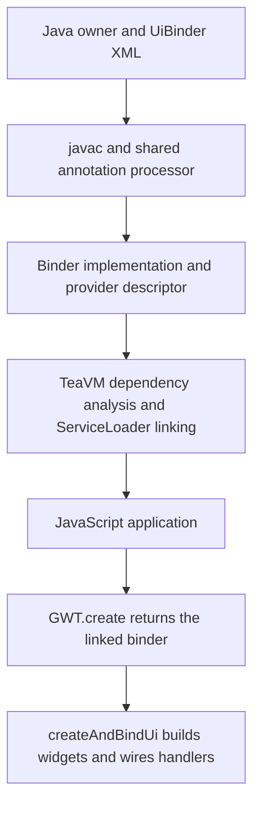

# UiBinder generation and linking

UiBinder support was first developed for Bootstrap Widgets and then extracted
into `gwt-uibinder-processor`. Material uses the same processor; its templates
extended support for generic setters and handlers, preformatted text, default
string constants and provided fields. This is shared TeaVM compatibility
infrastructure. Neither widget library owns the implementation or needs a
separate copy.

Start with the [usage guide](../gwt-uibinder-processor/README.md) and
[standalone example](../examples/uibinder). This document explains how that
example is generated, discovered and linked.

## Two service descriptors, two purposes

| Stage | Descriptor | Purpose |
| --- | --- | --- |
| javac annotation processing | `META-INF/services/javax.annotation.processing.Processor` in the processor JAR | Finds `io.instanto.widgets.processor.UiBinderProcessor` on the configured processor path |
| TeaVM application compilation | `META-INF/services/example.uibinder.GreetingView$Binder` in the application's classes or a library JAR | Finds the generated `example.uibinder.GreetingView_BinderImpl` provider |

The processor is a build dependency. `gwt-user-compat` supplies the application
APIs and `GWT.create` implementation. The generated binder is application code.
Only code reachable from the application's entry point and linked providers
needs to become part of the resulting JavaScript.



## From a template to a provider

Maven's normal `process-resources` phase copies
`src/main/resources/example/uibinder/GreetingView.ui.xml` into `target/classes`.
javac then runs the processor configured under `annotationProcessorPaths`.
The processor identifies the owner's nested `Binder` interface and searches for
`GreetingView.ui.xml` in the owner's package on the source path, classpath and
class output, in that order. XML parsing does not fetch external DTDs.

The processor uses javac's type information to resolve widget constructors,
setters, enum values, owner fields and handlers. It emits:

```text
target/generated-sources/annotations/example/uibinder/GreetingView_BinderImpl.java
target/classes/example/uibinder/GreetingView_BinderImpl.class
target/classes/META-INF/services/example.uibinder.GreetingView$Binder
```

The last file contains one provider name:

```text
example.uibinder.GreetingView_BinderImpl
```

The `$` is significant: service descriptors use the nested interface's Java
binary name, while Java source refers to it as `GreetingView.Binder`.
javac compiles the generated source in its annotation-processing rounds. The
normal JAR task packages the class and descriptor together.

`createAndBindUi(owner)` constructs the widget tree, assigns `@UiField` members,
applies setters and connects `@UiHandler` methods to the owner. Provided fields
reuse instances already initialised by the owner instead of constructing or
assigning replacements. The generated method can be called for different owners;
caching the binder does not cache the resulting widget tree.

## TeaVM linking and browser execution

The TeaVM compiler receives the application's compiled classes and dependency
JARs, including the generated descriptor. As its dependency analysis follows
`GWT.create(Binder.class)` into `ServiceLoader.load`, TeaVM's class-library support
reads the service descriptors for the reachable service type. It links provider
constructors and propagates their types into the application dependency graph.
Its JavaScript backend emits the service table and provider construction code.

This is TeaVM's existing `ServiceLoader` support; this processor does not install
a separate TeaVM compiler plugin for UiBinder. Keep the generated descriptor and
class on the compiler's application classpath. The processor path alone is not
the application classpath.

In the browser, `gwt-user-compat` resolves `GWT.create` in this order:

1. Return an implementation already registered for the class name.
2. Otherwise obtain the first linked `ServiceLoader` provider and cache it.
3. If no implementation is available, throw `IllegalStateException` naming the
   requested type and expected service descriptor.

An explicit `GWT.register(Binder.class, implementation)` takes precedence when
called before the relevant `GWT.create` call. Normal generated binders need no
manual registration or reflective constructor configuration. Avoid ambiguous
multiple providers; provider ordering is not an application selection mechanism.

The browser executes the compiled JavaScript. It does not scan JARs, fetch
`META-INF/services` files, run javac or parse `.ui.xml` templates. New templates or
providers require rebuilding the application. Widget CSS, scripts, images and
other externally loaded assets still follow the widget library's normal setup.

## Libraries and applications

Run the processor in the module that compiles each Java owner. A widget library
can publish its generated classes and descriptors in its TeaVM JAR; applications
using those precompiled views do not regenerate them. Applications with their own
UiBinder views configure the processor for those sources as well.

The processor also emits providers for its supported text ClientBundle and
default string-constant interfaces. They use the same service-loading route.
This does not implement arbitrary GWT deferred-binding rules, locale permutations
or every UiBinder feature. See the [supported subset](../gwt-uibinder-processor/README.md#supported-features-and-limits).

## Inspecting a build

In the standalone example, run `mvn clean package` and inspect:

```sh
cat target/generated-sources/annotations/example/uibinder/GreetingView_BinderImpl.java
cat 'target/classes/META-INF/services/example.uibinder.GreetingView$Binder'
jar tf target/hello-uibinder-1.0-SNAPSHOT.jar
```

If generation is missing, check `proc=full`, the processor path and the template's
package and name. The current processor warns and emits no provider when it
cannot find a template; that warning is not a TeaVM fallback to GWT generation.
An unsupported template construct should be resolved at Java compilation before
investigating browser behaviour.

If Java compiles but `GWT.create` fails, inspect the descriptor's binary name,
provider class and presence in the classes/JARs passed to TeaVM. Resource filters
must preserve `META-INF/services`; shaded JARs must merge service files rather
than overwrite them. Rebuild after changing resources to remove stale generated
output. If widgets appear but handlers do not run, also check attachment through
`RootPanel` or a parent widget and the widget library's initialisation.

Implementation references:

- [Processor discovery descriptor](../gwt-uibinder-processor/src/main/resources/META-INF/services/javax.annotation.processing.Processor)
- [Template processing and provider generation](../gwt-uibinder-processor/src/main/java/io/instanto/widgets/processor/UiBinderProcessor.java)
- [Widget construction and handler emission](../gwt-uibinder-processor/src/main/java/io/instanto/widgets/processor/Emitter.java)
- [Compatibility GWT.create implementation](../gwt-user-compat/src/main/java/com/google/gwt/core/client/GWT.java)
- TeaVM's [ServiceLoader dependency analysis](https://github.com/konsoletyper/teavm/blob/master/classlib/src/main/java/org/teavm/classlib/impl/ServiceLoaderSupport.java)
  and [JavaScript provider linking](https://github.com/konsoletyper/teavm/blob/master/classlib/src/main/java/org/teavm/classlib/impl/ServiceLoaderJSSupport.java).
